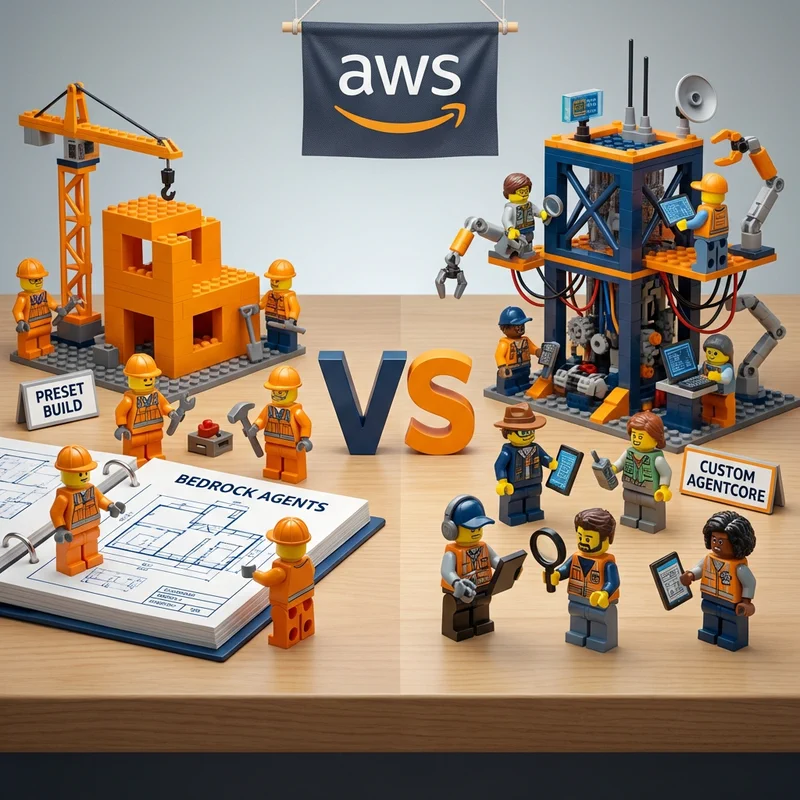

You spent three weeks building a LangGraph agent. You'll spend three months keeping it running in production.



In *The Hitchhiker's Guide to the Galaxy*, Ford Prefect and Zaphod Beeblebrox approach problems from opposite ends of the spectrum. Ford is practical, resourceful, and travels light -- he carries a towel and knows when to run. Zaphod is flashy, has two heads, three arms, and a stolen spaceship with an Infinite Improbability Drive. Both get the job done, but the operational overhead is rather different.

Self-hosting LangGraph is the Zaphod approach: impressive, powerful, and spectacularly high-maintenance. Docker images, ECS task definitions, load balancers, auto-scaling policies, security patching -- you need all the heads and arms you can get. AgentCore Runtime is the Ford Prefect approach: it replaces all of that with three CLI commands and a consumption-based bill where you never pay for idle infrastructure. Know where your towel is, and you are good.

## Deployment: Side by Side

### Self-Hosted LangGraph on ECS

```bash
# Build and push Docker image
docker build -t langgraph-agent .
aws ecr get-login-password --region us-east-1 | \
  docker login --username AWS --password-stdin $ACCOUNT.dkr.ecr.us-east-1.amazonaws.com
docker push $ACCOUNT.dkr.ecr.us-east-1.amazonaws.com/langgraph-agent:latest

# Create ECS infrastructure
aws ecs create-cluster --cluster-name langgraph-cluster
aws ecs register-task-definition --cli-input-json file://task-def.json
aws ecs create-service --cluster langgraph-cluster \
  --service-name langgraph-svc --task-definition langgraph-agent:1 \
  --desired-count 2 --launch-type FARGATE --network-configuration file://network.json

# Load balancer + auto-scaling
aws elbv2 create-load-balancer --name langgraph-alb \
  --subnets subnet-abc subnet-def --security-groups sg-xyz
aws application-autoscaling register-scalable-target \
  --service-namespace ecs --resource-id service/langgraph-cluster/langgraph-svc \
  --scalable-dimension ecs:service:DesiredCount --min-capacity 2 --max-capacity 20
```

Plus: Dockerfile, task-def.json, network.json, IAM roles, security groups, health checks, and a VPC. Zaphod would be proud -- that is a lot of heads to keep track of.

### LangGraph on AgentCore

```bash
agentcore create --framework langgraph --model-provider bedrock --name my-agent
agentcore deploy
agentcore invoke '{"prompt": "Analyze Q4 revenue trends"}'
```

The agent code is identical on both platforms:

```python
from langgraph.graph import StateGraph
from langchain_aws import ChatBedrock
from bedrock_agentcore.runtime import BedrockAgentCoreApp
from typing import TypedDict

class AgentState(TypedDict):
    messages: list
    response: str

graph = StateGraph(AgentState)

def process(state):
    model = ChatBedrock(model_id="us.anthropic.claude-haiku-4-5-20251001-v1:0")
    response = model.invoke(state["messages"])
    return {"response": response.content}

graph.add_node("process", process)
graph.set_entry_point("process")
graph.set_finish_point("process")
agent = graph.compile()

app = BedrockAgentCoreApp()

@app.entrypoint()
async def main(request):
    result = agent.invoke({"messages": [{"role": "user", "content": request["prompt"]}]})
    return {"response": result["response"]}

if __name__ == "__main__":
    app.run()
```

## Infrastructure Comparison

| Aspect | Self-Hosted (ECS) | AgentCore |
|--------|-------------------|-----------|
| **Compute** | ECS tasks, always-on | Serverless microVMs |
| **Load balancing** | ALB + target groups | Built-in |
| **Auto-scaling** | Scaling policies + alarms | Automatic |
| **Networking** | VPC, subnets, NAT, SGs | Managed |
| **SSL/TLS** | ACM + ALB config | Built-in |
| **Deployment** | Docker + ECR + ECS | `agentcore deploy` |
| **Time to production** | 2-4 weeks | Minutes |

## Security Comparison

| Aspect | Self-Hosted | AgentCore |
|--------|-------------|-----------|
| **Session isolation** | Shared container | Dedicated microVM per session |
| **Memory isolation** | OS process-level | Hardware VM-level |
| **Filesystem** | Shared or EFS | Isolated, sanitized after use |
| **Patching** | You manage everything | AWS-managed |
| **Blast radius** | All sessions in container | Single session only |

In self-hosted containers, a prompt injection achieving code execution can reach other sessions -- one Vogon gets in, and the entire fleet is compromised. In AgentCore, each session runs in its own microVM -- compromised sessions are fully isolated. Even the Vogons cannot breach that hull.

## Scaling Comparison

| Aspect | Self-Hosted | AgentCore |
|--------|-------------|-----------|
| **Scale-to-zero** | No (minimum tasks) | Yes |
| **Cold start** | 30-60s (container pull) | Seconds (microVM boot) |
| **Max concurrent** | Task count limited | 1,000/endpoint (adjustable) |
| **Scaling speed** | Minutes | Seconds |
| **Max session** | Unlimited (always billed) | 8 hours |

## Cost Comparison

Assumptions: 60-second sessions, 70% I/O wait, 1 vCPU, 1GB memory.

```
AgentCore per session:
  CPU:    18s active x ($0.0895/3600) = $0.000448
  Memory: 60s x 1GB x ($0.00945/3600) = $0.000158
  Total:  $0.000606

Self-hosted base cost (even with zero traffic):
  ALB + NAT + ECS (2 tasks) + CloudWatch = ~$135/month
```

| Monthly Invocations | AgentCore | Self-Hosted (ECS) | Savings |
|--------------------:|----------:|------------------:|--------:|
| **1,000** | $1 | $135 | 99% |
| **10,000** | $6 | $165 | 96% |
| **100,000** | $61 | $350 | 83% |

**Key pricing facts:** I/O wait is free (agents spend 30-70% of time waiting for LLM responses). 1-second billing granularity. $200 free tier for new customers. Sessions up to 8 hours.

## Migration Path

Moving from self-hosted to AgentCore requires no changes to agent logic:

1. Wrap your compiled graph with `BedrockAgentCoreApp` (shown above)
2. `pip install bedrock-agentcore-starter-toolkit`
3. `agentcore deploy`
4. Validate, then decommission ECS infrastructure

You replace the hosting layer, not the application layer.

## Recommendation

For new LangGraph deployments, start on AgentCore -- you eliminate weeks of infrastructure work and pay only for what you use. For existing deployments, evaluate migration when infrastructure maintenance costs exceed the effort of adding the AgentCore wrapper.

You do not need two heads and three arms to run a LangGraph agent in production. You just need a towel and `agentcore deploy`.

## Resources

- AgentCore docs: https://docs.aws.amazon.com/bedrock-agentcore/latest/devguide/
- LangGraph docs: https://langchain-ai.github.io/langgraph/
- Pricing: https://aws.amazon.com/bedrock/agentcore/pricing/
- Samples: https://github.com/awslabs/amazon-bedrock-agentcore-samples/

#AWS #AI #AgentCore #LangGraph #Architecture #Comparison
