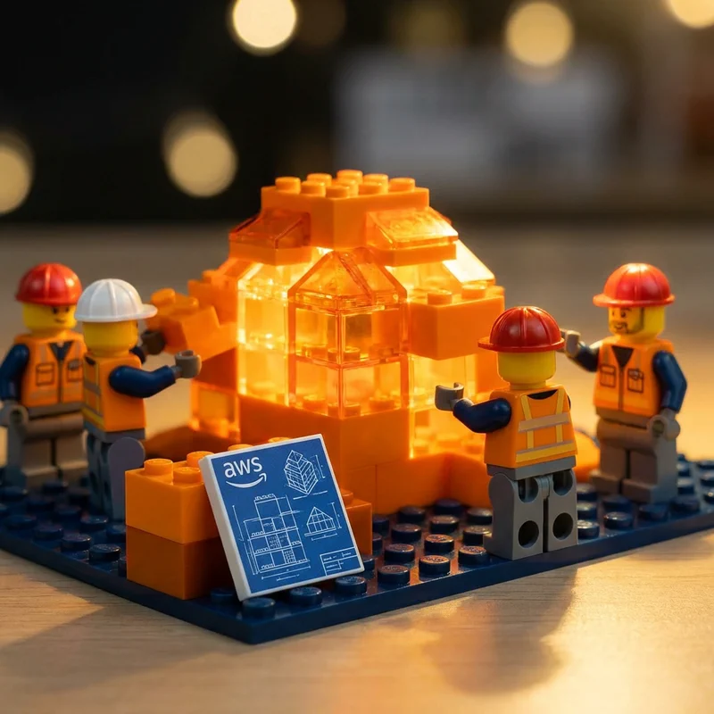

Your agent works on a laptop. It will fail in production. Here's the migration path:



Arthur Dent never planned to leave Earth. One Thursday morning he was lying in front of a bulldozer, and by lunchtime he was hurtling through space in his dressing gown. The journey from PoC to production is not unlike Arthur's -- reluctant, disorienting, and absolutely inevitable.

The demo went great. Now ship it. Except your PoC has no memory, no auth, no observability, and it runs on a single container. Your agent's entry in the Hitchhiker's Guide currently reads "Mostly Harmless." The gap between that and something genuinely useful is where most agent projects die.

AgentCore closes that gap incrementally. You migrate in stages: Runtime first, then Memory, Gateway, and Identity as demands grow.

## The PoC Anti-Pattern Checklist

| Gap | PoC Reality | Production Requirement |
|-----|-------------|----------------------|
| **Hosting** | Local process or single container | Serverless, auto-scaling, isolated sessions |
| **Memory** | In-process variables, lost on restart | Persistent short-term and long-term memory |
| **Tools** | Hardcoded API calls, embedded credentials | Managed gateway with auth and discovery |
| **Auth** | None, or a shared API key | Per-user identity with IdP integration |
| **Observability** | `print()` statements | Structured traces, metrics, dashboards |
| **Isolation** | Shared process for all users | MicroVM per session |

Three or more gaps? Not production-ready. Your agent is still standing in front of the bulldozer.

## Before: The Typical PoC Agent

```python
# poc_agent.py -- no persistence, no auth, no monitoring
from strands import Agent
from strands.models import BedrockModel
import requests

model = BedrockModel(model_id="us.anthropic.claude-haiku-4-5-20251001-v1:0")
agent = Agent(model=model, system_prompt="You are a helpful assistant.")

def lookup_order(order_id: str) -> dict:  # Hardcoded credentials
    return requests.get(f"https://api.example.com/orders/{order_id}",
                        headers={"X-API-Key": "sk-hardcoded-key-12345"}).json()

# No memory, no observability, no isolation -- all users share one process
if __name__ == "__main__":
    while True:
        print(f"Agent: {agent(input('You: '))}")
```

This works for demos. It fails under real traffic, multiple users, or a security review.

## Migration Step 1: Deploy to Runtime

This is the moment your agent hitches a ride off the planet. Wrap your existing logic in the `BedrockAgentCoreApp` entrypoint. No code rewrite required -- just grab your towel and go.

```bash
pip install bedrock-agentcore bedrock-agentcore-starter-toolkit
agentcore create --agent-framework Strands --model-provider Bedrock --project-name support-agent
agentcore dev                          # test locally
agentcore invoke --dev '{"prompt": "What is order ORD-12345?"}'
agentcore deploy                       # deploy to Runtime
```

Your entry point wraps the existing agent with three lines of boilerplate:

```python
from strands import Agent
from strands.models import BedrockModel
from bedrock_agentcore.runtime import BedrockAgentCoreApp

model = BedrockModel(model_id="us.anthropic.claude-haiku-4-5-20251001-v1:0", region_name="us-east-1")
agent = Agent(model=model, system_prompt="You are a helpful assistant.")
app = BedrockAgentCoreApp()

@app.entrypoint
async def main(request):
    return {"response": str(agent(request.get("prompt", "")))}

if __name__ == "__main__":
    app.run()
```

You now have serverless hosting, microVM isolation, auto-scaling, and CloudWatch logging.

## Migration Step 2: Add Memory

Create a memory resource, then integrate it. Your agent retains context across sessions.

```bash
agentcore memory create SupportAgentMemory --region us-east-1 --wait
```

```python
from bedrock_agentcore.memory.session import MemorySessionManager
from bedrock_agentcore.memory.constants import ConversationalMessage, MessageRole

memory = MemorySessionManager(memory_id="YOUR_MEMORY_ID", region_name="us-east-1")

@app.entrypoint
async def main(request):
    session = memory.create_memory_session(
        actor_id=request.get("user_id", "anonymous"),
        session_id=request.get("session_id", "default")
    )
    history = session.get_last_k_turns(k=10)
    result = agent(request.get("prompt", ""))
    session.add_turns(messages=[
        ConversationalMessage(request["prompt"], MessageRole.USER),
        ConversationalMessage(str(result), MessageRole.ASSISTANT)
    ])
    return {"response": str(result)}
```

## Migration Step 3: Add Gateway

Replace hardcoded API calls with managed MCP tools. Create a gateway, add your Lambda functions as targets:

```python
import boto3

control = boto3.client('bedrock-agentcore-control', region_name='us-east-1')
account_id = boto3.client('sts').get_caller_identity()['Account']

gateway = control.create_gateway(
    name='SupportGateway',
    roleArn=f'arn:aws:iam::{account_id}:role/GatewayExecutionRole',
    authorizerType='AWS_IAM', protocolType='MCP',
    protocolConfiguration={'mcp': {'searchType': 'SEMANTIC'}}
)

control.create_gateway_target(
    gatewayIdentifier=gateway['gatewayId'], name='OrderService',
    targetConfiguration={'mcp': {'lambda': {
        'lambdaArn': f'arn:aws:lambda:us-east-1:{account_id}:function:OrderLookup',
        'toolSchema': {'inlinePayload': [{'name': 'lookup_order',
            'description': 'Look up order status by order ID',
            'inputSchema': {'type': 'object',
                'properties': {'order_id': {'type': 'string'}},
                'required': ['order_id']}}]}
    }}}
)
```

Your hardcoded `requests.get()` becomes a managed MCP tool. Gateway is itself an MCP server, so any MCP client connects to its endpoint (SigV4-signed, since this gateway uses `AWS_IAM`):

```python
from strands.tools.mcp import MCPClient
from mcp.client.streamable_http import streamablehttp_client

gateway_url = control.get_gateway(gatewayIdentifier=gateway['gatewayId'])['gatewayUrl']
mcp_client = MCPClient(lambda: streamablehttp_client(gateway_url))
mcp_client.start()
agent = Agent(model=model, tools=mcp_client.list_tools_sync())
```

No more embedded credentials. Tools are discoverable, authenticated, and auditable.

## Migration Step 4: Add Identity

Replace shared API keys with per-user authentication. One CLI command connects your IdP:

```bash
agentcore identity setup-cognito --auth-flow user
```

This creates two Cognito pools -- one for inbound JWT authentication on your agent, one for outbound OAuth to external services -- and saves the configuration for subsequent commands.

For agents accessing external services, Identity vends user-scoped credentials:

```python
from bedrock_agentcore.services.identity import IdentityClient

identity = IdentityClient(region='us-east-1')

@app.entrypoint
async def main(request):
    user_token = request.get("bearer_token")
    if not user_token:
        return {"error": "Authentication required"}
    sf_token = identity.get_token(
        provider_name="salesforce",
        scopes=["api"],
        agent_identity_token=user_token,
        auth_flow="USER_FEDERATION",
    )
    result = agent(request.get("prompt", ""))
    return {"response": str(result)}
```

Every request is now authenticated. Every tool call uses the correct user's permissions.

## Production Readiness Checklist

- [ ] Agent deployed to Runtime (`agentcore deploy`) with microVM isolation
- [ ] Memory configured for session and cross-session persistence
- [ ] All tools routed through Gateway -- no hardcoded credentials
- [ ] JWT or IAM authorization on agent endpoint via Identity
- [ ] CloudWatch logs, OTEL traces, and metrics dashboards active
- [ ] Retry logic with exponential backoff for transient failures
- [ ] Least-privilege IAM execution role, no wildcard resource permissions
- [ ] End-to-end tests against deployed agent, not just local dev server

## Key Takeaway

Arthur Dent eventually learned to fly by throwing himself at the ground and missing. Migrating to production is similar -- you do not need to get everything right at once. You just need to start falling in the right direction.

Start with Runtime for hosting. Add Memory when users complain the agent forgets. Add Gateway when security flags hardcoded credentials. Add Identity when you go user-facing.

AgentCore is framework-agnostic. Whether your PoC uses Strands, LangGraph, CrewAI, or a custom framework, the path is the same: wrap your entry point, deploy, and layer on services incrementally. By the end, your Guide entry upgrades from "Mostly Harmless" to something far more impressive.

[View examples on GitHub](https://github.com/apresai/agentcore/tree/main/articles/examples/)

Documentation: https://docs.aws.amazon.com/bedrock-agentcore/latest/devguide/
GitHub samples: https://github.com/awslabs/amazon-bedrock-agentcore-samples/

#AWS #AI #AgentCore #Production #Migration #Architects
