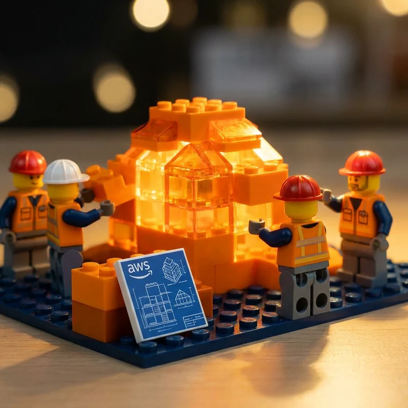

Running AI agents in production is a nightmare. You need container orchestration, auto-scaling, security isolation, and 24/7 monitoring—just to get started. It's enough to make Deep Thought, the great supercomputer from *The Hitchhiker's Guide to the Galaxy*, reconsider whether "42" was really worth all that effort.



Most teams spend weeks on infrastructure before their agent handles a single request — Deep Thought spent 7.5 million years computing the Answer to the Ultimate Question, but at least it didn't have to manage its own Kubernetes cluster. When something breaks at 3 AM? That's on you.

**AgentCore Runtime** eliminates this entirely. It's a serverless, purpose-built hosting environment where each user session runs in a dedicated microVM with isolated CPU, memory, and filesystem. You deploy with three commands. AWS handles the rest.

## Prerequisites

- AWS account with Bedrock AgentCore access
- Python 3.10+ installed
- Required packages: `bedrock-agentcore`, `strands-agents`

## Quick Start

```python
# AgentCore Runtime - Deploy an Agent in 3 Commands
from bedrock_agentcore import BedrockAgentCoreApp
from strands import Agent

app = BedrockAgentCoreApp()
agent = Agent()  # Uses Claude by default

@app.entrypoint
def invoke(payload):
    result = agent(payload.get("prompt", "Hello!"))
    return {"result": result.message}

if __name__ == "__main__":
    app.run()
```

## How to Run

```bash
# Install dependencies
pip install bedrock-agentcore strands-agents

# Test locally
python main.py

# Deploy to AWS (3 commands!)
agentcore configure -e main.py
agentcore launch
agentcore invoke '{"prompt": "Hello, AgentCore!"}'
```

Expected output:
```
✓ Agent configured
✓ Deploying to AgentCore Runtime...
✓ Agent deployed: arn:aws:bedrock-agentcore:us-east-1:123456789:runtime/my-agent
✓ Response: {"result": "Hello! I'm your AI assistant running on AgentCore..."}
```

**Key benefit**: I/O wait is free—you're not charged while your agent waits for LLM responses. Plus, agents can run up to 8 hours for complex, long-running tasks. Deep Thought would have killed for that billing model — imagine 7.5 million years of I/O wait charges.

Ready to go further? Add Memory for context, Gateway for tools, and Identity for auth—all with the same SDK. The answer to Life, the Universe, and Everything may be 42 — but the answer to production AI infrastructure is `agentcore launch`.

📚 Docs: https://docs.aws.amazon.com/bedrock-agentcore/latest/devguide/
💻 Code: `articles/examples/runtime/`

#AWS #AI #AgentCore #Runtime
