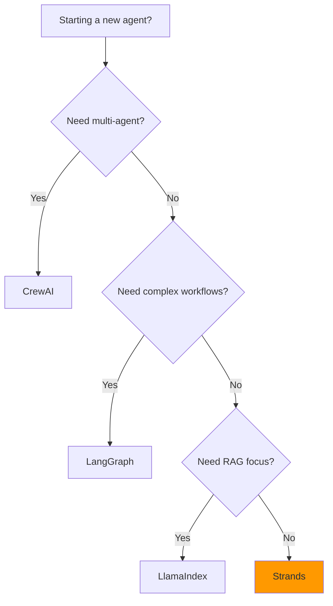

# Getting Started with AgentCore

Deploy your first AI agent to AWS Bedrock AgentCore in under 5 minutes.

## Prerequisites

Before you begin, ensure you have:

- [ ] **AWS Account** with appropriate IAM permissions
- [ ] **Python 3.9+** installed
- [ ] **AWS CLI** configured with credentials

> [!NOTE]
> New AWS customers receive **$200 in Free Tier credits** for AgentCore.

---

## Installation

### Step 1: Install the AgentCore SDK

```bash
pip install amazon-bedrock-agentcore
```

### Step 2: Install the Starter Toolkit CLI

```bash
pip install agentcore-starter-toolkit
```

### Step 3: Verify Installation

```bash
agentcore --version
```

---

## Hello World

### Create Your First Agent

```bash
agentcore create hello-agent
```

This creates a new agent project with the following structure:

```
hello-agent/
├── agent.py           # Your agent code
├── requirements.txt   # Dependencies
└── agentcore.yaml    # Configuration
```

### Examine the Agent Code

The generated `agent.py` contains a minimal agent:

```python
from strands import Agent
from strands.models import BedrockModel

def create_agent():
    """Create a simple AgentCore agent."""
    model = BedrockModel(model_id="anthropic.claude-3-haiku-20240307-v1:0")

    agent = Agent(
        model=model,
        system_prompt="You are a helpful assistant."
    )

    return agent

# AgentCore Runtime calls this function
agent = create_agent()
```

### Deploy to AgentCore

```bash
cd hello-agent
agentcore deploy
```

Expected output:

```
✓ Building agent package...
✓ Uploading to AgentCore...
✓ Deploying agent...

Agent deployed successfully!
  Name: hello-agent
  ARN:  arn:aws:bedrock-agentcore:us-east-1:123456789:agent/hello-agent
  URL:  https://hello-agent.agentcore.us-east-1.amazonaws.com
```

### Invoke Your Agent

```bash
agentcore invoke hello-agent "What is AgentCore?"
```

---

## Development Interfaces

| Interface | Use Case | Installation |
|-----------|----------|--------------|
| **AgentCore CLI** | Create, deploy, invoke, manage | `pip install agentcore-starter-toolkit` |
| **Python SDK** | Programmatic agent development | `pip install amazon-bedrock-agentcore` |
| **boto3** | Low-level AWS API access | `pip install boto3` |
| **AWS Console** | Visual management | [console.aws.amazon.com](https://console.aws.amazon.com) |

---

## SDK Quick Reference

### AgentCore SDK (Recommended)

```python
from bedrock_agentcore.runtime import RuntimeClient
from bedrock_agentcore.memory import MemoryClient
from bedrock_agentcore.gateway import GatewayClient

# Runtime
runtime = RuntimeClient()
response = runtime.invoke(agent_id="my-agent", input="Hello!")

# Memory
memory = MemoryClient()
session = memory.create_session(agent_id="my-agent")

# Gateway
gateway = GatewayClient()
tools = gateway.list_tools()
```

### boto3 (Alternative)

```python
import boto3

# Runtime
runtime = boto3.client('bedrock-agentcore-runtime')
response = runtime.invoke_agent(
    agentId='my-agent',
    input={'text': 'Hello!'}
)

# Memory
memory = boto3.client('bedrock-agentcore-memory')
session = memory.create_session(agentId='my-agent')
```

---

## CLI Commands

| Command | Description |
|---------|-------------|
| `agentcore create <name>` | Create a new agent project |
| `agentcore deploy` | Deploy agent to AgentCore |
| `agentcore invoke <name> "<message>"` | Invoke a deployed agent |
| `agentcore logs <name>` | View agent logs |
| `agentcore list` | List all agents |
| `agentcore delete <name>` | Delete an agent |
| `agentcore describe <name>` | Get agent details |

---

## Choosing a Framework

AgentCore supports multiple agent frameworks. Here's how to choose:



### Quick Framework Examples

<details>
<summary><b>Strands (Recommended for beginners)</b></summary>

```python
from strands import Agent
from strands.models import BedrockModel

model = BedrockModel(model_id="anthropic.claude-3-sonnet-20240229-v1:0")

agent = Agent(
    model=model,
    system_prompt="You are a helpful assistant.",
    tools=[...]  # Add tools here
)

response = agent.run("Hello!")
```

</details>

<details>
<summary><b>LangGraph</b></summary>

```python
from langgraph.graph import StateGraph
from langchain_aws import ChatBedrock

model = ChatBedrock(model_id="anthropic.claude-3-sonnet-20240229-v1:0")

# Define your graph
workflow = StateGraph(AgentState)
workflow.add_node("agent", agent_node)
workflow.add_edge(START, "agent")

app = workflow.compile()
```

</details>

<details>
<summary><b>CrewAI</b></summary>

```python
from crewai import Agent, Task, Crew

researcher = Agent(
    role='Researcher',
    goal='Find relevant information',
    backstory='Expert at finding information'
)

task = Task(
    description='Research AgentCore',
    agent=researcher
)

crew = Crew(agents=[researcher], tasks=[task])
result = crew.kickoff()
```

</details>

---

## Adding Services

### Add Memory

```python
from bedrock_agentcore.memory import MemoryClient

memory = MemoryClient()

# Create a session for context
session = memory.create_session(
    agent_id="my-agent",
    user_id="user-123"
)

# Add messages (short-term memory)
session.add_message(role="user", content="My name is Alice")
session.add_message(role="assistant", content="Hello Alice!")

# Store long-term facts
memory.store_fact(
    agent_id="my-agent",
    user_id="user-123",
    fact="User prefers formal communication"
)
```

### Add Tools via Gateway

```python
from bedrock_agentcore.gateway import GatewayClient

gateway = GatewayClient()

# From OpenAPI spec
tools = gateway.create_from_openapi(
    name="my-api",
    spec_url="https://api.example.com/openapi.json"
)

# From Lambda function
tool = gateway.create_from_lambda(
    name="my-tool",
    function_arn="arn:aws:lambda:us-east-1:123456789:function:my-function"
)

# 1-click integration
slack_tools = gateway.enable_integration("slack")
```

### Add Policy Rules

```python
from bedrock_agentcore.policy import PolicyClient

policy = PolicyClient()

# Natural language policy
policy.create_from_description(
    gateway_id="my-gateway",
    description="Only allow read operations on customer data"
)

# Cedar policy
policy.create_from_cedar(
    gateway_id="my-gateway",
    policy="""
    permit(
        principal,
        action == Action::"read",
        resource in ResourceGroup::"customer-data"
    );
    """
)
```

---

## Next Steps

1. **Explore Services**: Read the [Services Reference](services/) for deep dives
2. **Try Examples**: Check out [runnable examples](../articles/examples/)
3. **Learn Patterns**: See [use case examples](../README.md#use-cases)
4. **Optimize Costs**: Review [pricing details](../research/11-pricing.md)

---

## Troubleshooting

### Common Issues

<details>
<summary><b>Permission Denied errors</b></summary>

Ensure your IAM user/role has the required permissions:

```json
{
    "Version": "2012-10-17",
    "Statement": [
        {
            "Effect": "Allow",
            "Action": [
                "bedrock-agentcore:*"
            ],
            "Resource": "*"
        }
    ]
}
```

</details>

<details>
<summary><b>Agent not responding</b></summary>

1. Check agent logs:
   ```bash
   agentcore logs my-agent
   ```

2. Verify deployment status:
   ```bash
   agentcore describe my-agent
   ```

3. Ensure the agent is in `ACTIVE` state

</details>

<details>
<summary><b>Model access denied</b></summary>

Enable model access in Amazon Bedrock:

1. Go to [Amazon Bedrock Console](https://console.aws.amazon.com/bedrock/)
2. Navigate to **Model access**
3. Request access to required models (Claude, Nova, etc.)

</details>

---

## Resources

| Resource | Link |
|----------|------|
| AWS Documentation | [AgentCore Developer Guide](https://docs.aws.amazon.com/bedrock-agentcore/latest/devguide/) |
| API Reference | [AgentCore API Reference](https://docs.aws.amazon.com/bedrock-agentcore/latest/APIReference/) |
| Samples | [GitHub Samples](https://github.com/awslabs/amazon-bedrock-agentcore-samples/) |
| Pricing | [AgentCore Pricing](https://aws.amazon.com/bedrock/agentcore/pricing/) |
