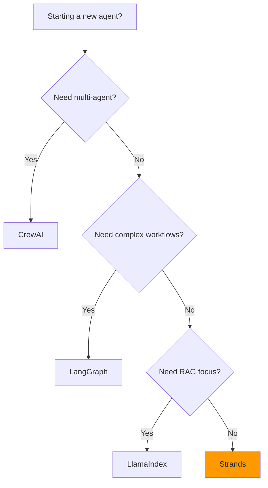

# Getting Started with AgentCore

Deploy your first AI agent to AWS Bedrock AgentCore in under 5 minutes.

## Prerequisites

Before you begin, ensure you have:

- [ ] **AWS Account** with appropriate IAM permissions
- [ ] **Python 3.10+** installed
- [ ] **AWS CLI** configured with credentials

> [!NOTE]
> New AWS customers receive **$200 in Free Tier credits** for AgentCore.

---

## Installation

### Step 1: Install the AgentCore SDK

```bash
pip install bedrock-agentcore
```

### Step 2: Install the Starter Toolkit CLI

```bash
pip install bedrock-agentcore-starter-toolkit
```

### Step 3: Verify Installation

The top-level CLI only accepts `--help` (there is no `--version` flag):

```bash
agentcore --help
```

---

## Hello World

### Create Your First Agent

`create` takes no positional name argument - pass the project name with `-p`/`--project-name`. Project names are alphanumeric only (no `-` or `_`), up to 36 characters, so `hello-agent` itself isn't valid; use `helloagent`:

```bash
agentcore create --project-name helloagent --agent-framework Strands --model-provider Bedrock
```

This creates a new agent project with the following structure:

```
helloagent/
├── src/
│   └── main.py              # Your agent code
├── test/
│   └── test_main.py         # Tests
├── pyproject.toml           # Dependencies
├── .bedrock_agentcore.yaml  # Configuration
└── README.md
```

### Examine the Agent Code

The generated `src/main.py` contains a minimal agent (simplified here for illustration - the real scaffold wires in additional tooling by default):

```python
from strands import Agent
from strands.models import BedrockModel

def create_agent():
    """Create a simple AgentCore agent."""
    model = BedrockModel(model_id="us.anthropic.claude-haiku-4-5-20251001-v1:0")

    agent = Agent(
        model=model,
        system_prompt="You are a helpful assistant."
    )

    return agent

# AgentCore Runtime calls this function
agent = create_agent()
```

### Deploy to AgentCore

```bash
cd helloagent
agentcore deploy
```

By default this deploys to AgentCore Runtime without local Docker - for a fresh Strands scaffold like this one, that means direct code deploy (your Python is uploaded and run as-is); container deployments, when used, build in the cloud via CodeBuild. It prints the deployed agent's runtime ARN when it finishes, in the form:

```
arn:aws:bedrock-agentcore:us-east-1:123456789012:agent-runtime/helloagent-abc123
```

There is no public HTTPS URL for the agent - invocation goes through `agentcore invoke` or the `invoke_agent_runtime` API, both shown below.

### Invoke Your Agent

`invoke` takes one required positional argument - a JSON payload, not a bare string. The agent name is passed with `--agent`/`-a` only if it can't be inferred from `.bedrock_agentcore.yaml`:

```bash
agentcore invoke '{"prompt": "What is AgentCore?"}'
```

---

## Development Interfaces

| Interface | Use Case | Installation |
|-----------|----------|--------------|
| **AgentCore CLI** | Create, deploy, invoke, manage | `pip install bedrock-agentcore-starter-toolkit` |
| **Python SDK** | Programmatic agent development | `pip install bedrock-agentcore` |
| **boto3** | Low-level AWS API access | `pip install boto3` |
| **AWS Console** | Visual management | [console.aws.amazon.com](https://console.aws.amazon.com) |

---

## SDK Quick Reference

### AgentCore SDK (Recommended)

```python
from bedrock_agentcore.runtime import AgentCoreRuntimeClient
from bedrock_agentcore.memory import MemoryClient
from bedrock_agentcore.gateway import GatewayClient

# Runtime - AgentCoreRuntimeClient manages runtime resources (create, update,
# delete, endpoints, status); it has no invoke() method. Invoking a deployed
# agent is a data-plane call - see the boto3 example below.
runtime = AgentCoreRuntimeClient(region="us-east-1")
status = runtime.get_aggregated_status(agent_runtime_id="my-agent-id")

# Memory - there is no create_session(); store a conversation turn directly
memory = MemoryClient(region_name="us-east-1")
memory.create_event(
    memory_id="my-memory-id",
    actor_id="user-alice",
    session_id="session-123",
    messages=[("Hello!", "USER")],
)

# Gateway - GatewayClient manages gateway/target resources, not individual
# tools; agents call tools over MCP against the gateway's URL (see the
# Gateway service reference for the MCP client pattern).
gateway = GatewayClient(region_name="us-east-1")
gateways = gateway.list_gateways(maxResults=50)
```

### boto3 (Alternative)

Only `bedrock-agentcore` (data plane) and `bedrock-agentcore-control` (control plane) are real botocore service names - there is no `bedrock-agentcore-runtime` or `bedrock-agentcore-memory` service.

```python
import boto3
import json

# Runtime - invoking an agent is a data-plane call
runtime = boto3.client('bedrock-agentcore', region_name='us-east-1')
response = runtime.invoke_agent_runtime(
    agentRuntimeArn='arn:aws:bedrock-agentcore:us-east-1:123456789012:agent-runtime/my-agent',
    runtimeSessionId='session-123',
    payload=json.dumps({'prompt': 'Hello!'}).encode()
)

# Memory - also on the data-plane client
memory = boto3.client('bedrock-agentcore', region_name='us-east-1')
memory.create_event(
    memoryId='mem-abc123xyz',
    actorId='user-alice',
    sessionId='session-123',
    eventTimestamp='2024-01-15T10:30:00Z',
    payload=[{'conversational': {'role': 'USER', 'content': {'text': 'Hello!'}}}]
)
```

---

## CLI Commands

There is no `agentcore logs`, `agentcore list`, `agentcore delete`, or `agentcore describe` - use `status`/`destroy` below and CloudWatch for logs.

| Command | Description |
|---------|-------------|
| `agentcore create -p <name>` | Create a new agent project |
| `agentcore deploy` | Deploy agent to AgentCore |
| `agentcore invoke '<json-payload>'` | Invoke a deployed agent |
| `agentcore status [-v]` | Get deployment status (config, agent, endpoint) |
| `agentcore destroy` | Remove the deployed agent and its resources |
| `agentcore stop-session` | Stop an active runtime session |
| `agentcore configure` | Manage per-agent configuration (region, IAM role, memory, timeouts) |

---

## Choosing a Framework

AgentCore supports multiple agent frameworks. Here's how to choose:


```mermaid
graph TD
    A[Starting a new agent?] --> B{Need multi-agent?}
    B -->|Yes| C[CrewAI]
    B -->|No| D{Need complex workflows?}
    D -->|Yes| E[LangGraph]
    D -->|No| F{Need RAG focus?}
    F -->|Yes| G[LlamaIndex]
    F -->|No| H[Strands]

    style H fill:#FF9900,color:#232F3E
```

### Quick Framework Examples

<details>
<summary><b>Strands (Recommended for beginners)</b></summary>

```python
from strands import Agent
from strands.models import BedrockModel

model = BedrockModel(model_id="us.anthropic.claude-haiku-4-5-20251001-v1:0")

agent = Agent(
    model=model,
    system_prompt="You are a helpful assistant.",
    tools=[...]  # Add tools here
)

# Agent has no .run() method - call it directly, or use invoke_async() in
# an async context.
response = agent("Hello!")
```

</details>

<details>
<summary><b>LangGraph</b></summary>

```python
from langgraph.graph import StateGraph
from langchain_aws import ChatBedrock

model = ChatBedrock(model_id="us.anthropic.claude-haiku-4-5-20251001-v1:0")

# Define your graph
workflow = StateGraph(AgentState)
workflow.add_node("agent", agent_node)
workflow.add_edge(START, "agent")

app = workflow.compile()
```

</details>

<details>
<summary><b>CrewAI</b></summary>

```python
from crewai import Agent, Task, Crew

researcher = Agent(
    role='Researcher',
    goal='Find relevant information',
    backstory='Expert at finding information'
)

task = Task(
    description='Research AgentCore',
    agent=researcher
)

crew = Crew(agents=[researcher], tasks=[task])
result = crew.kickoff()
```

</details>

---

## Adding Services

### Add Memory

There is no `create_session()`. Create a memory resource once, then record turns with `create_event()`:

```python
from bedrock_agentcore.memory import MemoryClient

memory = MemoryClient(region_name="us-east-1")

# One-time setup: create the memory resource with a long-term strategy
mem = memory.create_memory_and_wait(
    name="MyAgentMemory",
    strategies=[
        {"semanticMemoryStrategy": {"name": "FactExtractor", "namespaces": ["facts"]}}
    ],
)

# Store a conversation turn (short-term memory) - messages are (text, role)
# tuples, not role=/content= keyword calls.
memory.create_event(
    memory_id=mem["memoryId"],
    actor_id="user-123",
    session_id="session-abc",
    messages=[
        ("My name is Alice", "USER"),
        ("Hello Alice!", "ASSISTANT"),
    ],
)

# Long-term facts are extracted automatically by the strategy above, not
# stored with a store_fact() call. Retrieve them semantically later:
facts = memory.retrieve_memories(
    memory_id=mem["memoryId"],
    namespace="facts",
    query="communication preferences",
)
```

### Add Tools via Gateway

`GatewayClient` manages gateway and target *resources* - it has no `create_from_openapi`/`create_from_lambda`/`enable_integration` methods. Create a gateway, then attach a Lambda function as a target:

```python
from bedrock_agentcore.gateway import GatewayClient

gateway = GatewayClient(region_name="us-east-1")

# Waits for the gateway to reach READY (or raises on FAILED)
gw = gateway.create_gateway_and_wait(
    name="MyGateway",
    roleArn="arn:aws:iam::123456789012:role/GatewayRole",
    authorizerType="AWS_IAM",
    protocolType="MCP",
)

# Wrap a Lambda function as an MCP tool target
target = gateway.create_gateway_target_and_wait(
    gatewayIdentifier=gw["gatewayId"],
    name="MyTool",
    targetConfiguration={
        "mcp": {
            "lambda": {
                "lambdaArn": "arn:aws:lambda:us-east-1:123456789012:function:my-function",
                "toolSchema": {
                    "inlinePayload": [
                        {
                            "name": "my_tool",
                            "description": "What this tool does",
                            "inputSchema": {"type": "object", "properties": {}},
                        }
                    ]
                },
            }
        }
    },
)
```

Agents call gateway tools over MCP against `gw["gatewayUrl"]`, not through a Python method on `GatewayClient` - see the Gateway service reference for the MCP client pattern.

### Add Policy Rules

`bedrock_agentcore.policy` exports `PolicyEngineClient`, not `PolicyClient`, and its methods take `policy_engine_id=`, not `gateway_id=`:

```python
from bedrock_agentcore.policy import PolicyEngineClient

policy = PolicyEngineClient(region_name="us-east-1")

engine = policy.create_or_get_policy_engine(name="MyPolicyEngine")

# Cedar policy
policy.create_or_get_policy(
    policy_engine_id=engine["policyEngineId"],
    name="read_only_customer_data",
    definition={
        "cedar": {
            "statement": """
    permit(
        principal,
        action == Action::"read",
        resource in ResourceGroup::"customer-data"
    );
    """
        }
    },
)
```

---

## Next Steps

1. **Explore Services**: Read the [Services Reference](services/) for deep dives
2. **Try Examples**: Check out [runnable examples](../articles/examples/)
3. **Learn Patterns**: See [use case examples](../README.md#use-cases)
4. **Optimize Costs**: Review [pricing details](../research/11-pricing.md)

---

## Troubleshooting

### Common Issues

<details>
<summary><b>Permission Denied errors</b></summary>

Ensure your IAM user/role has the required permissions:

```json
{
    "Version": "2012-10-17",
    "Statement": [
        {
            "Effect": "Allow",
            "Action": [
                "bedrock-agentcore:*"
            ],
            "Resource": "*"
        }
    ]
}
```

</details>

<details>
<summary><b>Agent not responding</b></summary>

1. Check agent logs (log group includes the endpoint name):
   ```bash
   aws logs tail /aws/bedrock-agentcore/runtimes/<agent_id>-DEFAULT --follow
   ```

2. Verify deployment status:
   ```bash
   agentcore status --agent helloagent --verbose
   ```

3. Ensure the agent is in `ACTIVE` state

</details>

<details>
<summary><b>Model access denied</b></summary>

Enable model access in Amazon Bedrock:

1. Go to [Amazon Bedrock Console](https://console.aws.amazon.com/bedrock/)
2. Navigate to **Model access**
3. Request access to required models (Claude, Nova, etc.)

</details>

---

## Resources

| Resource | Link |
|----------|------|
| AWS Documentation | [AgentCore Developer Guide](https://docs.aws.amazon.com/bedrock-agentcore/latest/devguide/) |
| API Reference | [AgentCore API Reference](https://docs.aws.amazon.com/bedrock-agentcore/latest/APIReference/) |
| Samples | [GitHub Samples](https://github.com/awslabs/amazon-bedrock-agentcore-samples/) |
| Pricing | [AgentCore Pricing](https://aws.amazon.com/bedrock/agentcore/pricing/) |
